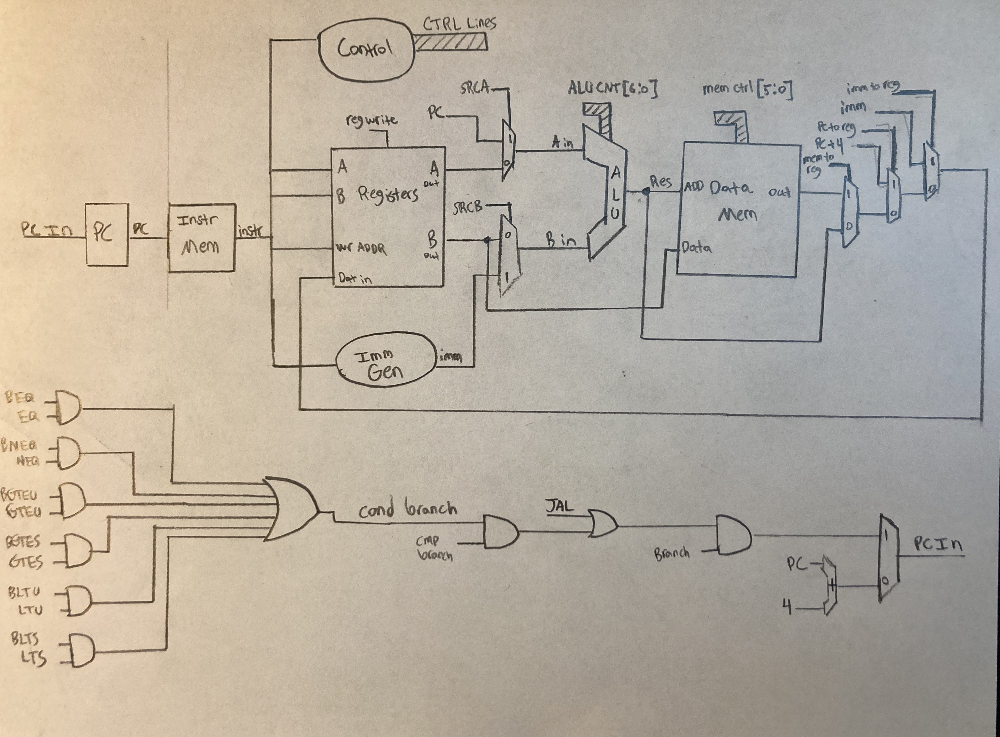

# CPE CPU

## Overview
The CPE CPU is a softcore CPU implementing the Risk-V RV32I instruction set (with very small caveats of no FENCE, ECALL, or EBREAK. I'm not supporting multiple cores or GNU Debugger extensions). 

It was designed completely heirachically with a high focus on readability, and it's main purpose was for me to develop a better understanding of Computer Architecture. 


## CPE_CPU - The Design
The design is based on the microarchitecture detailed in Patterson and Hennesy's Computer Architecture and Design book with slight modifications 

### CPE CPU Microarchitecture
 
Drawn with the newest update of the industry leading GAD system (Graphite Assisted Design) 


### CPE_CPU
 

The focus here was by no means to be efficient. I mean this is a single cycle processor, it's far from efficient. The goal was simplicity, and I can make improvements from there. I saw an intersting write up on a simple two stage pipeline that I may try out next :) 

## Sub Modules

### ALU
The ALU is the heart of the processor. I aimed for a rather simple version with only the basic control lines (before realizing it wasn't capable of doing a few oddball instructions and bastardizing my design, I'll make it prettier later, I promise). 


The ALU is capable of performing all of the basic arithmetic operations on the systems. The A input can come from either register output 1, or from the program counter, and the B input can either come from register output 2 or the immediate generator. 

addi_sub_flag_w_i forces an add even when were adding an immediate (ADDI allowed negative control bits on the standard ALU control bits). 
store_force_add_flag_w_i forces the ALU to add so that it can calculate the proper memory address. Again due to competing control lines. 
branch_force_add_flag_w_i forces the ALU to, you guessed it, add again. I need to calculate the memory and these all have different control signals that contradict one another. A smarter man than I would have OR'ed them at the top level. 

### CMP_GEN
This module simply compares the outputs of register out 1 and register out 2 and gives you some comparison flags based upon them. These flags control branch instructions later. 

 


### COND_BRANCH_CONTROL
This module determines based upon the instruction in and the compare flags from cmp_gen whether or not a branch should be taken. This alongside the control registers that MUX of the PC input determine the branch result.

 


### CONTROL
This module takes in the op code and sets the relative control signals to the expected values. Alongside the conditional branch control this determines what path the signals take throughout the chip. It controls things like the mux lines, the memory control signals, and the memory word selects (for Byte, HW, and Word reads and writes). It also enables or disables the branch at the top level based on opcode. 

 


### IMM_GEN
This module takes the instruction input and based upon the opp code and function values it will generate the appropritate immediate.

 

### PC
The program counter simply counts based upon the selected input. This will just be PC + 4 if you're not branching, and if you are branching the result will be dependent upon the instruction. 

 

### REGISTERS
The register page updates the registers based upon the write value and write address every clock cycle. It will output the selected outputs 1 and 2 as soon as the internal combitorial logic allows as well. The register page contains 32, 32-bit registers. Register 0 will always be zero, even if written to.

 

## Testing
Test development was done on Linux using icurus verilog alongside make. GTKWave was used for the waveform viewer. Sub modules are self checking, but at the top level I model the memory and check results by hand. The instruction list can be seen within the ISA Breakdown spreadsheet within the notes folder. 

### Requirements
``` shell
sudo apt install iverilog gtkwave
```

### Running Tests
```shell
cd CPE_CPU/sim/rtl_sim/
# Target names listed below
make TARGET_NAME
# If you want to run the whole suit regressively and search for errors run this
make all|grep errors
# Or this to store to a file
make all >> test_res.dat
```

### Test Targets
* all    # Run all tests regressively
* cpe_cpu    # Only one that isn't self checking :(
* alu
* cmp_gen
* control
* imm_gen
* pc
* registers
* cond_branch_control

#### Note
When testing cpe_cpu the expected results are stored in the isa breakdown spreadsheet in the note folder.


